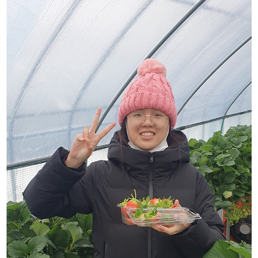
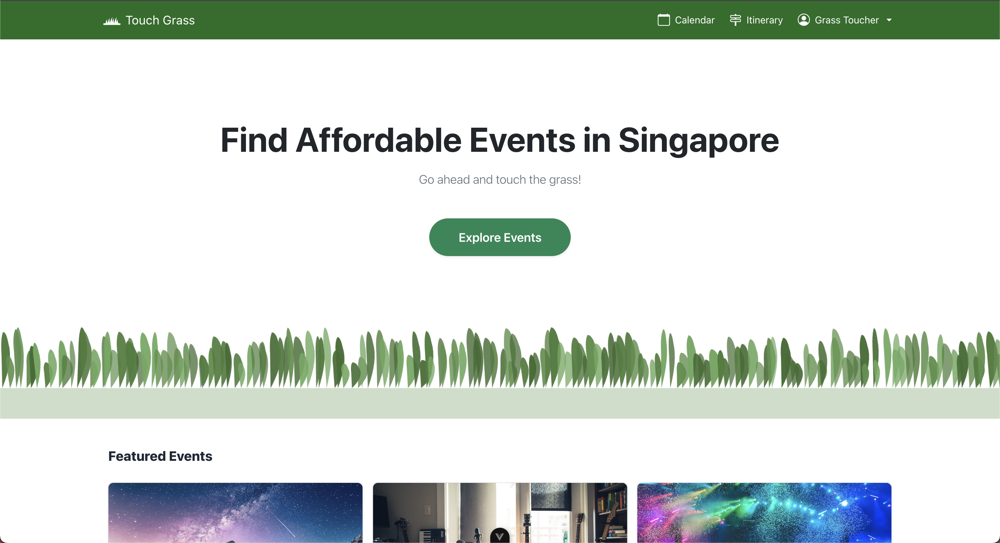
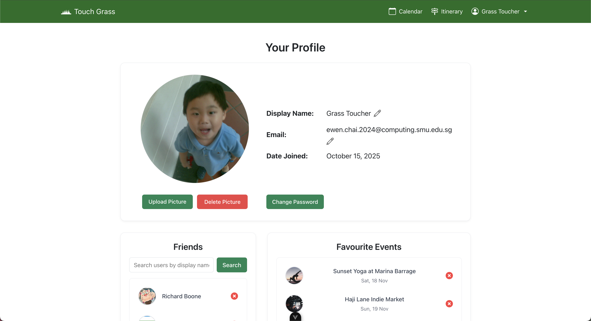
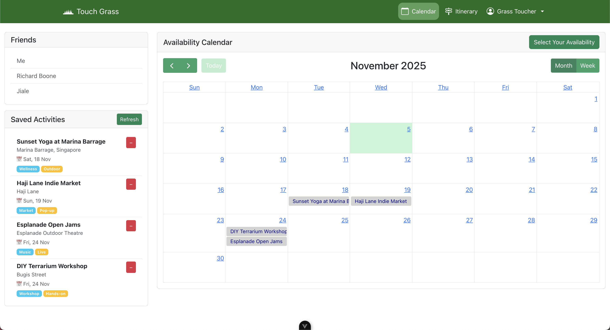
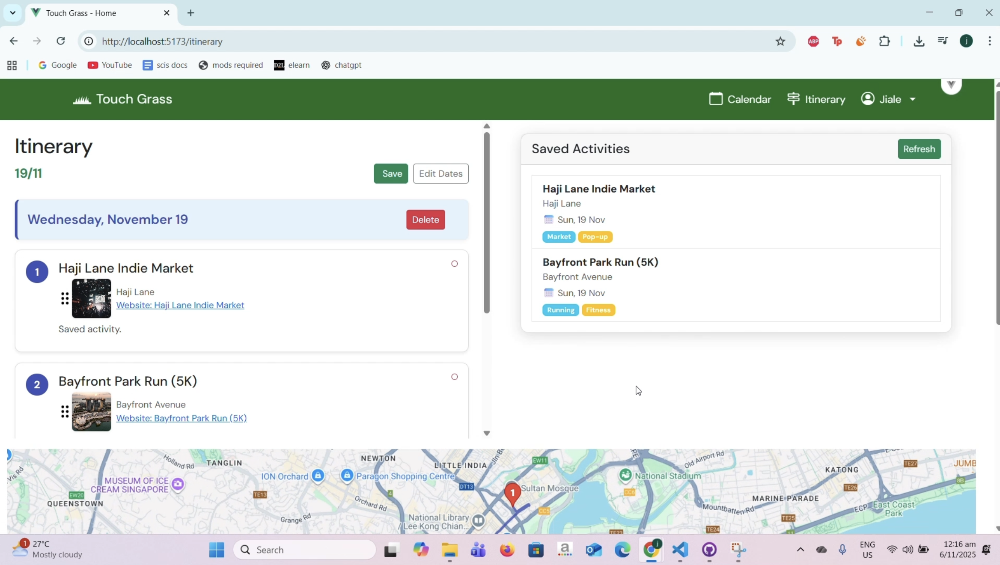

# IS216 Web Application Development II

---

## G3T2 Touch Grass
 
---

## Group Members

| Photo | Full Name | Role / Features Responsible For |
|:--:|:--|:--|
|  | Ewen Chai | Frontend Developer - Search & Filter UI |
|  | Richard Fritzgerald Boone | Backend Developer - API endpoints |
|  | Lai Xiao Thong | UI/UX Designer - Layout & Color Themes |
|  | Fazil Akram Dereinda | Database & Auth - Firebase Integration |
|  | Mohamed Wasil Raseen | Database & Auth - Firebase Integration |
|  | Lim Jia Le | Database & Auth - Firebase Integration |


---

## Business Problem

<!-- Describe the **real-world business or community problem** your project addresses. -->

> Nowadays, Singaporean youths are facing high stress levels and poor mental health, wiht one in three reporting negative well-being (IMH, 2024). Key contributing factors include loneliness, social isolation, and excessive social media usage. 
> Research has shown that social connections play a pivotal role in supporting mental well-being—interacting with friends and family through face-to-face gatherings and shared activities can greatly enhance both mental and overall health (WHO, 2025).
> In spite of this, youths still face many resisting factors that deter them from building and maintaining these relationships. 
> Common barriers include a lack of awareness about social events happening around Singapore, conflicting schedules among peers, differing activity preferences, and financial limitations. As a result, many young people struggle to find accessible and enjoyable opportunities for meaningful social engagement. 
---

## Web Solution Overview

### Intended Users
Singaporean Youths (aged 18-40 years old)

### What Users Can Do & Benefits
Explain the core features and the benefit each provides.  

| Feature | Description | User Benefit |
|:--|:--|:--|
| Register & Login | Secure authentication system | Customisable Profile | Find Friends |
| Search & Filter | Find items by category or location | Saves time finding relevant results | Filter by CDC and Culture Pass |
| Calendar | Plan out your schedule | Align availability with Friends | 
| Itinerary | Plan routes for their days out |

---

## Tech Stack

| Logo | Technology | Purpose / Usage |
|:--:|:--|:--|
|  | **HTML5** | Structure and content |
|  | **CSS3 / Bootstrap** | Styling and responsiveness |
|  | **JavaScript (ES6)** | Client-side logic and interactivity |
|  | **Vite** | Development server and build tool |
|  | **Vue.js 3** | Component-based frontend framework |
|  | **Firebase** | Authentication and database services |

---

## Use Case & User Journey

Provide screenshots and captions showing how users interact with your app.

1. **Landing Page**  
     
   - Displays the homepage with navigation options.

2. **Profile Page**  
     
   - Users customise their profile name, email, upload profile picture, see saved activities, and add friends.

3. **Calendar Page**  
     
   - Shows your calendar, allows users to indicate their availabilities and see their friends availabilities.

3. **Itinerary Page**  
     
   - Plan your day with the routes

> Save screenshots inside `/screenshots` with clear filenames.

---

## Developers Setup Guide

Comprehensive steps to help other developers or evaluators run and test your project.

---

### 0) Prerequisites
- [Git](https://git-scm.com/) v2.4+  
- [Node.js](https://nodejs.org/) v18+ and npm v9+  
- Access to backend or cloud services used (Firebase, MongoDB Atlas, AWS S3, etc.)

---

### 1) Download the Project
```bash
git clone https://github.com/ewvnn/touch-grass.git
cd touch-grass
npm install
```

---

### 2) Configure Environment Variables
Create a `.env` file in the root directory with the following structure:

```bash
VITE_API_URL=<your_backend_or_firebase_url>
VITE_FIREBASE_API_KEY=<your_firebase_api_key>
VITE_FIREBASE_AUTH_DOMAIN=<your_auth_domain>
VITE_FIREBASE_PROJECT_ID=<your_project_id>
VITE_FIREBASE_STORAGE_BUCKET=<your_storage_bucket>
VITE_FIREBASE_MESSAGING_SENDER_ID=<your_sender_id>
VITE_FIREBASE_APP_ID=<your_app_id>
```

> Never commit the `.env` file to your repository.  
> Instead, include a `.env.example` file with placeholder values.

---

### 3) Backend / Cloud Service Setup

#### Firebase
1. Go to [Firebase Console](https://console.firebase.google.com/)
2. Create a new project.
3. Enable the following:
   - **Authentication** → Email/Password sign-in
   - **Firestore Database** or **Realtime Database**
   - **Hosting (optional)** if you plan to deploy your web app
4. Copy the Firebase configuration into your `.env` file.

#### Optional: Express.js / MongoDB
If your app includes a backend:
1. Create a `/server` folder for backend code.
2. Inside `/server`, create a `.env` file with:
   ```bash
   MONGO_URI=<your_mongodb_connection_string>
   JWT_SECRET=<your_jwt_secret_key>
   ```
3. Start the backend:
   ```bash
   cd server
   npm install
   npm start
   ```

---

### 4) Run the Frontend
To start the development server:
```bash
npm run dev
```
The project will run on [http://localhost:5173](http://localhost:5173) by default.

To build and preview the production version:
```bash
npm run build
npm run preview
```

---

### 5) Testing the Application

#### Manual Testing
Perform the following checks before submission:

| Area | Test Description | Expected Outcome |
|:--|:--|:--|
| Authentication | Register, Login, Logout | User successfully signs in/out |
| CRUD Operations | Add, Edit, Delete data | Database updates correctly |
| Responsiveness | Test on mobile & desktop | Layout adjusts without distortion |
| Navigation | All menu links functional | Pages route correctly |
| Error Handling | Invalid inputs or missing data | User-friendly error messages displayed |

#### Automated Testing (Optional)
If applicable:
```bash
npm run test
```

---

### 6) Common Issues & Fixes

| Issue | Cause | Fix |
|:--|:--|:--|
| `Module not found` | Missing dependencies | Run `npm install` again |
| `Firebase: permission-denied` | Firestore security rules not set | Check rules under Firestore → Rules |
| `CORS policy error` | Backend not allowing requests | Enable your domain in CORS settings |
| `.env` variables undefined | Missing `VITE_` prefix | Rename variables to start with `VITE_` |
| `npm run dev` fails | Node version mismatch | Check Node version (`node -v` ≥ 18) |

---

## Group Reflection

Each member should contribute 2–3 sentences on their learning and project experience.

> **Example Template:**  
> - *Alice:* Learned to build reusable Vue components and manage state effectively.  
> - *Ben:* Gained experience connecting frontend and backend APIs.  
> - *Chloe:* Improved UI/UX design workflow and collaboration using Figma.  
> - *David:* Understood how Firebase Authentication and Firestore integrate with modern SPAs.  

As a team, reflect on:
- Key takeaways from working with real-world frameworks  
- Challenges faced and how they were resolved  
- Insights on teamwork, project management, and problem-solving 
